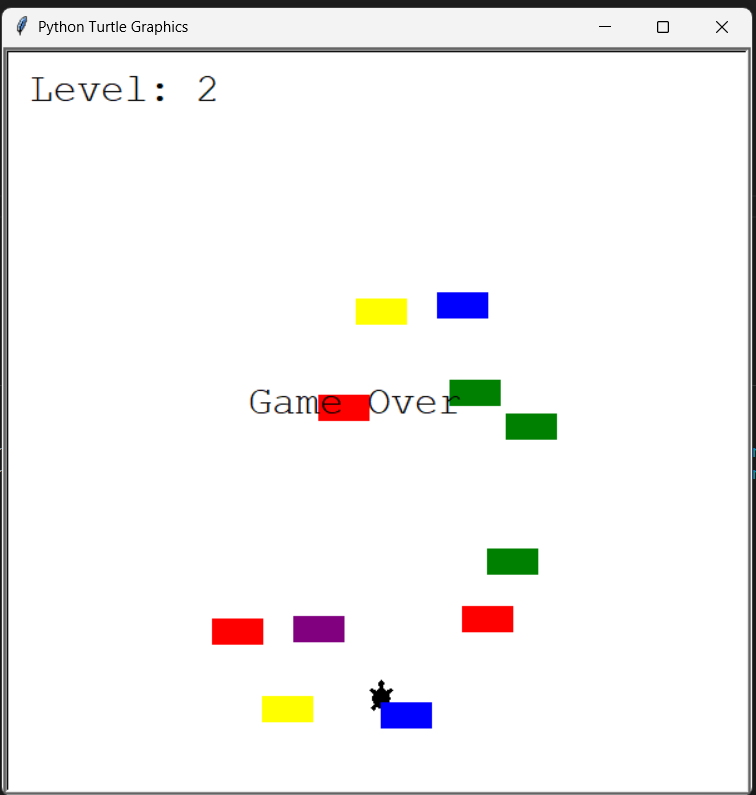

# 🐢 Turtle Crossing Game

A fun arcade game built with Python where the player avoids moving cars and crosses the road to reach the next level.

## 📸 Screenshot



## ✨ Features

* 🚗 Randomly generated moving cars
* 🐢 Player-controlled turtle
* 📈 Increasing difficulty with each level
* 💥 Collision detection
* 🏆 Level tracking
* 🎮 Smooth gameplay using Turtle Graphics

## 🎮 Controls

| Key   | Action       |
| ----- | ------------ |
| **↑** | Move Forward |

## 🛠️ Technologies Used

* Python 3
* Turtle Graphics
* Object-Oriented Programming (OOP)

## 📂 Project Structure

```text
turtle-crossing-game/
│── main.py
│── player.py
│── car_manager.py
│── scoreboard.py
│── turtle_crossing.png
└── README.md
```

## ▶️ How to Run

Run the following command:

```bash
python main.py
```


## 👨‍💻 Author

**Biswajit Dhar**

If you enjoyed this project, consider giving it a ⭐ on GitHub!
